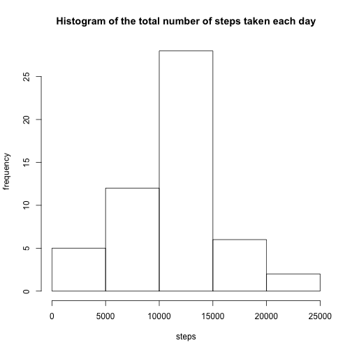
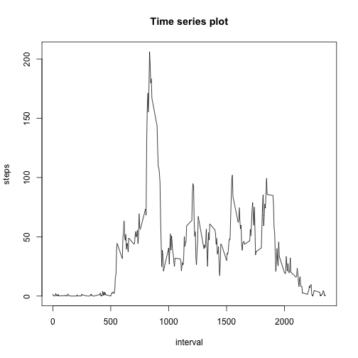
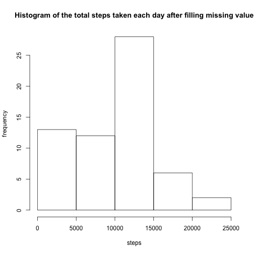
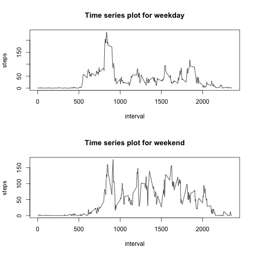

## Reading(load) and preprocessing the data

```r
activity <- read.csv("~/Documents/R/activity.csv", header = TRUE, sep = ",", quote = "\"",
         dec = ".", fill = TRUE, comment.char = "")
attach(activity)
```
## calculate the total number of steps taken per day

```r
total_number<-aggregate(steps~date,activity,sum)
#print(total_number)
```

## Histogram of the total number of steps taken each day

```r
hist(total_number$steps,
     main="Histogram of the total number of steps taken each day", 
  	xlab="steps", ylab="frequency") 
```


## Mean and median number of steps taken each day


```r
mean_number<-aggregate(steps~date,activity,mean)
#print(mean_number)
median_number<-aggregate(steps~date,activity,median)
#print(median_number)
```

## Time series plot of the average number of steps taken

```r
mean_interval<-aggregate(steps~interval,activity,mean)
#print(mean_interval)
library(plotly)
```

```
## Loading required package: ggplot2
```

```
## 
## Attaching package: 'plotly'
```

```
## The following object is masked from 'package:ggplot2':
## 
##     last_plot
```

```
## The following object is masked from 'package:graphics':
## 
##     layout
```

```r
library(webshot)
plot(mean_interval, type = "l",main="Time series plot",
  	xlab="interval", ylab="steps")  
```



## Calculate and report the total number of missing values in the dataset 

```r
sapply(activity, function(x) sum(is.na(x)))
```

```
##    steps     date interval 
##     2304        0        0
```
## Filling in all of the missing values in the dataset use the mean for that day, and create a new dataset that is equal to the original dataset but with the missing data filled in.

```r
activity2<-activity
for (i in 1:nrow(activity2))
{
activity2$steps[which(is.na(activity2$steps),activity2$interval==5*(i-1))]<- mean(activity$steps[activity$interval==5*(i-1)], na.rm = TRUE)
}
```
## Histogram of the total number of steps taken each day after replacing missing value

```r
total_number2<-aggregate(steps~date,activity2,sum)
hist(total_number2$steps,main= "Histogram of the total steps taken each day after filling missing value", xlab="steps", ylab="frequency")  
```



```r
# Mean/median values were added to dates where the original NAs were missing, other date's mean/median values stay the same. After imputing missing data, the estimates of the total daily number of steps have a higher frequency at lower steps
```
## Mean and median number of steps taken each day after replacing missing value


```r
mean_number2<-aggregate(steps~date,activity2,mean)
#print(mean_number2)
median_number2<-aggregate(steps~date,activity2,median)
#print(median_number2)
```
## Create a new factor variable in the dataset with two levels -- "weekday" and "weekend" indicating whether a given date is a weekday or weekend day.

```r
activity3<-activity
activity3$date <- as.Date(activity3$date)
#create a vector of weekdays
weekdays1 <- c('Monday', 'Tuesday', 'Wednesday', 'Thursday', 'Friday')
activity3$wDay <- c('weekend', 'weekday')[(weekdays(activity3$date) %in% weekdays1)+1L]
```
## Time series plot of the average number of steps taken for weekend and weekday

```r
mean_week<-aggregate(steps~interval+wDay,activity3,mean)
#print(mean_week)
mean_weekday<-mean_week[mean_week$wDay == "weekday",]
mean_weekend<-mean_week[mean_week$wDay == "weekend",]
library(plotly)
par(mfrow=c(2,1))
  plot(mean_weekday$interval, mean_weekday$steps,type = "l", main="Time series plot for weekday",
  	xlab="interval", ylab="steps")
  plot(mean_weekend$interval, mean_weekend$steps, type = "l",main="Time series plot for weekend",
  	xlab="interval", ylab="steps")
```



